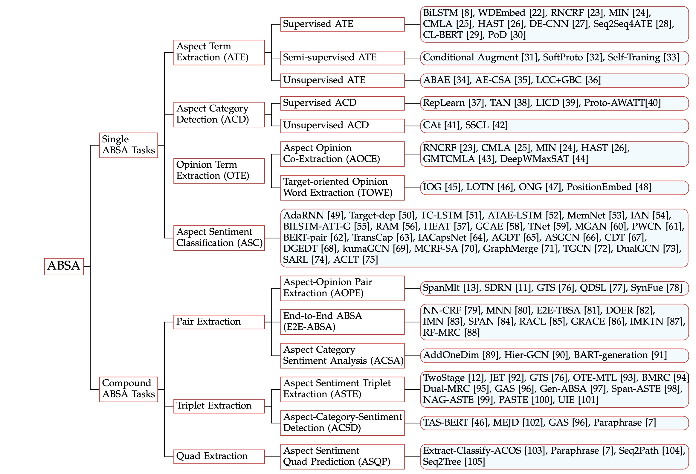

# ABSA-Survey
Various resources about Aspect-based Sentiment Analysis (ABSA), set up for our recent *updated* survey paper - [A Survey on Aspect-Based Sentiment Analysis: Tasks, Methods, and Challenges](https://arxiv.org/abs/2203.01054).

🔖 [2022-11-6] This is our first release, feel free to contact us if you find any missing important papers. You are also welcome to create a pull request to contribute anything you feel useful!


## Paper List

*Taxonomy of ABSA tasks, with representative methods of each task. Taken from Fig 2 of [this survey paper](https://arxiv.org/abs/2203.01054).*

### Single ABSA
#### Aspect Term Extraction (ATE)
Supervised ATE
- Fine-grained Opinion Mining with Recurrent Neural Networks and Word Embeddings. (EMNLP 2015)
- Recursive Neural Conditional Random Fields for Aspect-based Sentiment Analysis. (EMNLP 2016) 
- Coupled Multi-Layer Attentions for Co-Extraction of Aspect and Opinion Terms. (AAAI 2017) 
- Deep Multi-Task Learning for Aspect Term Extraction with Memory Interaction. (EMNLP 2017)
- Aspect Term Extraction with History Attention and Selective Transformation. (IJCAI 2018)
- Double Embeddings and CNN-based Sequence Labeling for Aspect Extraction. (ACL 2018)
- BERT Post-Training for Review Reading Comprehension and Aspect-based Sentiment Analysis. (NAACL 2019)

Semi-supervised ATE
- Conditional Augmentation for Aspect Term Extraction via Masked Sequence-to-Sequence Generation. (ACL 2020) 
- Enhancing Aspect Term Extraction with Soft Prototypes. (EMNLP 2020)
- Progressive Self-Training with Discriminator for Aspect Term Extraction. (EMNLP 2021) 

Unsupervised ATE
- An Unsupervised Neural Attention Model for Aspect Extraction. (ACL 2017) 
- Unsupervised Neural Aspect Extraction with Sememes. (IJCAI 2019) 

#### Aspect Category Detection (ACD)
Supervised ACD
- Representation Learning for Aspect Category Detection in Online Reviews. (AAAI 2015)
- Supervised and Unsupervised Aspect Category Detection forSentiment Analysis with Co-occurrence Data. (IEEE-TCYB 2018) 
- Aspect Category Detection via Topic-Attention Network. (arXiv 2019)
- LICD: A Language-Independent Approach for Aspect Category Detection. (ECIR 2019)

Unsupervised ACD
- Embarrassingly Simple Unsupervised Aspect Extraction. (ACL 2020) 
- A Simple and Effective Self-Supervised Contrastive Learning Framework for Aspect Detection. (AAAI 2021)

#### Opinion Term Extraction (OTE)
Aspect-Opinion Co-Extraction (AOCE)
- Recursive Neural Conditional Random Fields for Aspect-based Sentiment Analysis. (EMNLP 2016)
- Coupled Multi-Layer Attentions for Co-Extraction of Aspect and Opinion Terms. (AAAI 2017)
- Deep Multi-Task Learning for Aspect Term Extraction with Memory Interaction. (EMNLP 2017)
- Aspect Term Extraction with History Attention and Selective Transformation. (IJCAI 2018) 
- Global inference for aspect and opinion terms co-extraction based on multi-task neural networks. (IEEE TASLP 2018)
- Deep Weighted MaxSAT for Aspect-based Opinion Extraction. (EMNLP 2020) 

Target-oriented Opinion Words Extraction (TOWE)
- Target-oriented Opinion Words Extraction with Target-fused Neural Sequence Labeling. (NAACL 2019)
- Latent Opinions Transfer Network for Target-Oriented Opinion Words Extraction. (AAAI 2020)
- Introducing Syntactic Structures into Target Opinion Word Extraction with Deep Learning. (EMNLP 2020)
- An Empirical Study on Leveraging Position Embeddings for Target-oriented Opinion Words Extraction. (EMNLP 2021)

#### Aspect-based Sentiment Classification (ASC)
> We do not include ASC papers here due to the massive amount of papers available, you can refer to surveys dedicated to ASC for details.


### Compound ABSA
#### Aspect-Opinion Pair Extraction (AOPE)
- SpanMlt: A Span-based Multi-Task Learning Framework for Pair-wise Aspect and Opinion Terms Extraction. (ACL 2020)
- Synchronous Double-channel Recurrent Network for Aspect-Opinion Pair Extraction. (ACL 2020)
- Question-Driven Span Labeling Model for Aspect–Opinion Pair Extraction. (AAAI 2021) 
- Learn from Syntax: Improving Pair-wise Aspect and Opinion Terms Extraction with Rich Syntactic Knowledge. (IJCAI 2021)

#### Aspect Category Sentiment Analysis (ACSA)
- Joint Aspect and Polarity Classification for Aspect-based Sentiment Analysis with End-to-End Neural Networks. (EMNLP 2018)
- A Joint Model for Aspect-Category Sentiment Analysis with Shared Sentiment Prediction Layer. (CCL 2020) 
- Aspect-Category based Sentiment Analysis with Hierarchical Graph Convolutional Network. (COLING 2020)

#### End-to-End ABSA (E2E-ABSA)
- Open Domain Targeted Sentiment. (EMNLP 2013)
- Neural Networks for Open Domain Targeted Sentiment. (EMNLP 2015)
- Towards a One-stop Solution to Both Aspect Extraction and Sentiment Analysis Tasks with Neural Multi-task Learning. (IJCNN 2018)
- A Unified Model for Opinion Target Extraction and Target Sentiment Prediction. (AAAI 2019)
- An Interactive Multi-Task Learning Network for End-to-End Aspect-Based Sentiment Analysis. (ACL 2019)
- DOER: Dual Cross-Shared RNN for Aspect Term-Polarity Co-Extraction. (ACL 2019) 
- Open-Domain Targeted Sentiment Analysis via Span-Based Extraction and Classification. (ACL 2019)  
- Exploiting BERT for End-to-End Aspect-based Sentiment Analysis. (WUT@EMNLP-19) 
- Relation-Aware Collaborative Learningfor Unified Aspect-Based Sentiment Analysis. (ACL 2020)
- An Iterative Multi-Knowledge Transfer Network for Aspect-Based Sentiment Analysis. (EMNLP-Findings 2021) 

#### Aspect Sentiment Triplet Extraction (ASTE)
- Knowing What, How and Why: A Near Complete Solution for Aspect-Based Sentiment Analysis. (AAAI 2020) 
- Position-Aware Tagging for Aspect Sentiment Triplet Extraction. (EMNLP 2020) 
- Grid Tagging Scheme for Aspect-oriented Fine-grained Opinion Extraction. (EMNLP-Findings 2020) 
- A Multi-task Learning Framework for Opinion Triplet Extraction. (EMNLP-Findings 2020) 
- A Joint Training Dual-MRC Framework for Aspect Based Sentiment Analysis. (AAAI 2021)
- Bidirectional Machine Reading Comprehension for Aspect Sentiment Triplet Extraction. (AAAI 2021)
- Towards Generative Aspect-Based Sentiment Analysis. (ACL 2021) 
- A Unified Generative Framework for Aspect-Based Sentiment Analysis. (ACL 2021) 
- Learning Span-Level Interactions for Aspect Sentiment Triplet Extraction. (ACL 2021)
- PASTE: A Tagging-Free Decoding Framework Using Pointer Networks for Aspect Sentiment Triplet Extraction. (EMNLP 2021)
- Structural Bias For Aspect Sentiment Triplet Extraction. (COLING 2022)

#### Aspect-Category-Sentiment Detection (ACSD) 
- Aspect Based Sentiment Analysis into the Wild. (WASSA@EMNLP 2018) 
- Target-Aspect-Sentiment Joint Detection for Aspect-Based Sentiment Analysis. (AAAI 2020) 
- Multiple-element Joint Detection for Aspect-Based Sentiment Analysis. (KBS 2021)
- Towards Generative Aspect-Based Sentiment Analysis. (ACL 2021) 

#### Aspect Sentiment Quad Prediction (ASQP)
- Aspect-Category-Opinion-Sentiment Quadruple Extractionwith Implicit Aspects and Opinions. (ACL 2021) 
- Aspect Sentiment Quad Prediction as Paraphrase Generation. (EMNLP 2021)
- Seq2Path: Generating Sentiment Tuples as Paths of a Tree (ACL-Findings 2022)
- Aspect-based Sentiment Analysis with Opinion Tree Generation. (IJCAI 2022)


### Survey Papers
- Survey on Aspect-Level Sentiment Analysis. (TKDE 2016)
- Deep Learning for Aspect-Based Sentiment Analysis: A Comparative Review. (ESWA 2019)
- Deep Learning for Aspect-Level Sentiment Classification: Survey, Vision, and Challenges. (IEEE Access 2019)
- Issues and Challenges of Aspect-based Sentiment Analysis: A Comprehensive Survey. (IEEE-TAC 2020)
- Aspect-Based Sentiment Analysis: A Survey of Deep Learning Methods. (IEEE-TCSS 2020)
- Beneath the Tip of the Iceberg: Current Challengesand New Directions in Sentiment Analysis Research. (IEEE-TAC 2020)


## Resources

### Reading List
There are other useful reading lists of ABSA (from different angles), check them out!
- https://github.com/NUSTM/ABSA-Reading-List
- https://github.com/ZhengZixiang/ABSAPapers
- https://github.com/1429904852/Aspect-Based-Sentiment-Analysis

### Datasets
For more details, you can check Sec 2.4 of our survey paper. Here are some direct links
- SemEval-2014: https://alt.qcri.org/semeval2014/task4/
- SemEval-2015: https://alt.qcri.org/semeval2015/task12/
- SemEval-2016: https://alt.qcri.org/semeval2016/task5/
- TOWE: https://github.com/NJUNLP/TOWE
- ASC-QA: https://github.com/jjwangnlp/ASC-QA
- MAMS: https://github.com/siat-nlp/MAMS-for-ABSA
- ARTS: https://github.com/zhijing-jin/ARTS_TestSet
- ASTE-Data-V2: https://github.com/xuuuluuu/Position-Aware-Tagging-for-ASTE
- ASAP: https://github.com/Meituan-Dianping/asap
- ACOS: https://github.com/NUSTM/ACOS
- ABSA-QUAD: https://github.com/IsakZhang/ABSA-QUAD
- Lasted: https://github.com/GeneZC/StructBias

### Useful Repos
- https://github.com/songyouwei/ABSA-PyTorch: Aspect Based Sentiment Analysis based on PyTorch Implementations. 
- https://github.com/yangheng95/PyABSA: Open Framework for Aspect-based Sentiment Analysis based on state-of-the-art Models
- https://github.com/lixin4ever/BERT-E2E-ABSA: Exploiting BERT for End-to-End Aspect-based Sentiment Analysis
- https://github.com/AlexYangLi/ABSA_Keras: Keras Implementation of Aspect based Sentiment Analysis


## Citation
If you find this repo or our survey paper helpful, pls consider star 🌟 and cite 📝!
```
@article{absa-survey,
  author    = {Wenxuan Zhang and
               Xin Li and
               Yang Deng and
               Lidong Bing and
               Wai Lam},
  title     = {A Survey on Aspect-Based Sentiment Analysis: Tasks, Methods, and Challenges},
  journal   = {CoRR},
  volume    = {abs/2203.01054},
  year      = {2022},
  url       = {https://doi.org/10.48550/arXiv.2203.01054},
  doi       = {10.48550/arXiv.2203.01054}
}
```
